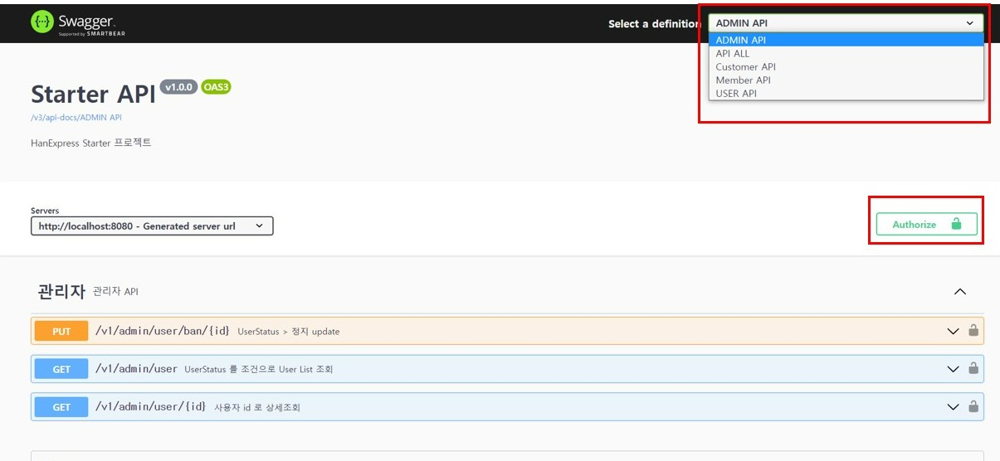

# Pagination 모듈 사용 방법

### 1. 페이지네이션 모듈의 적용

#### 1.1 Pagination 모듈을 적용하고자하는 객체들에 대한 Java File을 생성한다.
**(예시)** 
```Java
// Controller Layer
@RestController
@RequestMapping("${sampleApiBaseUrl}")
public class SampleController { }

// Service Layer
@Service
public class SampleService { }

// Repository
public interface SampleRepository { }

// Entity
public class Sample { }

// DTO
public class SampleDto { }

...

```

#### 1.2 각 레이어에 해당하는 파일들에 아래의 각 추상 extends 키워드를 통해 상속한다.

**(필수 사항)**
- [PaginationAbstractController.java](./controller/PaginationAbstractController.java)
- [PaginationAbstractService.java](./service/PaginationAbstractService.java)
- [PaginationRepository.java](./repository/PaginationRepository.java)

**(선택 사항)**
- [GenericAbstractEntity.java](./domain/GenericAbstractEntity.java)
- [GenericAbstractDto.java](./dto/GenericAbstractDto.java)
- [GenericConverter.java](./utils/GenericConverter.java)

**위 추상 클래스 및 인터페이스** 파일들을 모듈의 각 Class Object에 상속하여 사용하면 된다.

  - 엔티티 클래스 및 DTO 클래스 작성방법 #1 (선택 사항 적용 X)
```Java
// Entity 파일 작성
// T : @Id로 사용하고자하는 멤버변수의 타입
@Table("tb_sample")
public class Sample {
    @Id
    private T id;
    ....
}

// Dto 파일 작성
public class SampleDto {
    ...
}
```
  - 엔티티 클래스 및 DTO 클래스 작성방법 #2 (선택 사항 적용)
```Java
// Entity 파일 작성
// T : @Id로 사용하고자하는 멤버변수의 타입
@Table("tb_sample")
public class Sample extends GenericAbstractEntity<SampleDto>{
    @Id
    private T id;
    ....

    // 조회된 Entity를 Dto로 변환하는
    @Override
    public SampleDto toDto() {
        return ...
    }
}

// Dto 파일 작성
public class SampleDto extends GenericAbstractDto<Sample, T>{
    ...
    
    // 저장용 Entity로 변환하는 메소드
    @Override
    public Sample toEntity() {
        return ...
    }

    // 수정용 Entity로 변환하는 메소드
    @Override
    public Sample toEntity(T id) {
        return ...
    }
}
```

  - 각 Layer의 필수 파일 작성
```Java
// Repository 파일 작성
public interface SampleRepository extends PaginationRepository<Sample, T> { }

// Service 파일 작성
@Service
public class SampleService extends PaginationAbstractService<Sample, T, SampleDto> {
    public SampleService(SampleRepository sampleRepository) {
        super(sampleRepository);
    }

    @Override
    public SampleDto apply(Sample entity) {
        // List<Entity>를 List<DTO>로 변환하는 Functional Interface의 변환기 구현 부분입니다.
        return SampleDto.builer()
                        . ...
                        . ...
                        .build();
    }
}

// Controller 파일 작성
@RestController
@RequestMapping("${sampleApiBaseUrl}")
public class SampleController extends PaginationAbstractController<Sample, T ,SampleDto> {
    public final SampleService sampleSerivce;

    public SampleController(SampleService sampleService) {
        super(sampleService);
    }
}
```

**(!)** Service 파일의 apply() 메소드의 경우, 제네릭 컨버터에서 Functional Interface를 구현하여 사용하기 위함에 있다.

<hr>

### 2. Pageable 관련 설정

#### 2.1 Pageable 설정
- [PageableVerificationArgumentResolver.java](./config/PageableVerificationArgumentResolver.java)
  <br>위 파일에서는 Pageable 인터페이스 사용 시, 기본적인 유효성 검증 오류처리가 작성된다.
- [PageableHandlerMethodArgumentResolver](./config/PageableHandlerMethodArgumentResolver.java)
  <br>위 파일에서 configurePageableResolver 메소드를 통해 Pageable 사용 시의 설정을 변경가능하다.

#### 2.2 Swagger - Pageable Schema
- [PageableSchema](./annotation/PageableSchema.java)
  <br>위의 CustomAnnotation을 활용하여 Swagger에서 표현되는 Pageable 스키마를 사용자화 할 수 있다.

<hr>

### 3. 실제 적용 예시

**(필수적 적용 사항)**
- [NoticeController.java](../notice/controller/NoticeController.java)
- [NoticeService.java](../notice/service/NoticeService.java)
- [NoticeRepository.java](../notice/repository/NoticeRepository.java)

**(선택적 적용 사항)**
- [Notice.java](../notice/domain/Notice.java)
- [NoticeDto.java](../notice/dto/NoticeDto.java)

**(!)** [GenericConverter.java](./utils/GenericConverter.java)의 경우, [PaginationAbstractService.java](./service/PaginationAbstractService.java)에서 상속을 받아 이미 사용하고 있다.
<br>&nbsp;&nbsp;&nbsp;
때문에, 상속받은 Service 파일 내부에서 apply 메소드에 대한 오버라이딩 후 사용한다.

**(!!)** 해당 모듈이 적용 된 파일에서는, 기존 Lombok의 @RequiredArgsConstructor Annotation을 super()와 충돌이 발생하여 사용할 수 없다.

<hr>

### 4. API TEST

**(!)** 기본적으로 stater API가 최소한의 동작을 하는 환경에서 실행되어야 한다.

#### 4.1 HTTP 파일을 이용한 API 테스트

- HTTP 파일 참고
  - [Notice API 테스트](../../../../../../../../http/notices.http)

#### 4.2 swagger를 이용한 API 테스트
- {auth-starter URL}**/swagger-ui/index.html**으로 접속하면 Swagger 화면을 확인할 수 있다.
  - http://localhost:8080/swagger-ui/index.html



##### 4.2.1 화면 접속후 API 별 Grouping이 되어있으므로, Select Combo Box에서 선택해야한다.
  - API ALL을 선택하거나 Notice API를 선택하여, 예시로 작성된 공지사항 RESTful API를 확인할 수 있다.

##### 4.2.2 페이지네이션 동작 확인 방법
  - 기본적으로 페이지네이션 추상 클래스는 상속받은 Controller의 기본 URL에 대한 [**GET**]요청을 수행한다.
  - 페이지네이션 동작을 위해 전달해야 하는 파라미터는 아래와 같다.
     - **page (Integer)** : 페이지 번호
     - **size (Interger)** : 페이지 크기
     - **sort (Array of String)** : 정렬 기준 및 순서
  - page 및 size 값을 전달하지 않는 경우, 기본 값은 **page=1**, **size=10**이다.
  - sort 값을 전송하는 경우,
    <br>**정렬 기준**이 되는 **엔티티 클래스 객체의 멤버변수 이름을 반드시 기입**해야하며,
    <br>**정렬 방법**은 기본적으로 **asc(오름차순)** 정렬이다.
  - sort값은 "**${멤버변수 명},asc**" 또는 "**${멤버변수 명},desc**"로 기입한다.